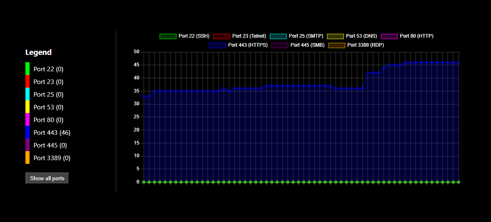

# LineChartMonitor

**LineChartMonitor** è un'applicazione web interattiva che visualizza in tempo reale le connessioni delle porte attive sotto forma di grafico lineare.

## Caratteristiche

- **Grafici a linee in tempo reale**: Monitora le connessioni di rete su porte specifiche e visualizza i dati in grafici a linee aggiornati ogni secondo.
- **Supporto per più porte**: Visualizza i dati di diverse porte di rete comunemente monitorate come SSH(22), Telnet(23), HTTP(80), HTTPS(443), RDP(3389), DNS(53), SMTP(25), SMB(445).
- **Interattività**: Filtra i dati visualizzati in base alla porta selezionata tramite la legenda laterale.

## Installazione

- cd backend

    - python -m venv venv
    - source venv/bin/activate  # Su macOS/Linux
    - .\venv\Scripts\activate   # Su Windows
    - python app.py

- cd .. (frontend)

    - npm install
    - npm start

